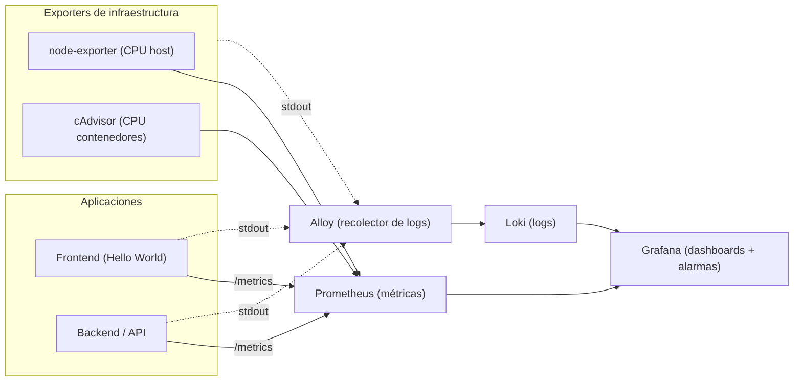

# Laboratorio de Observabilidad

- **Curso:** Infraestructura Como Código
- **Estudiante:** Bryan Gabriel Ruiz Tulumba

---

## 1. Objetivos de aprendizaje

Al terminar este laboratorio serás capaz de:

1. Explicar el rol de cada componente de un stack de observabilidad (métricas, logs, visualización y recolección) y por qué se aprovisiona como código.
2. Levantar el stack completo con un único `docker compose up`, entendiendo qué provisiona cada servicio.
3. Construir un **dashboard** en Grafana que combine métricas de infraestructura y logs de aplicación e infraestructura.
4. Configurar una **alarma** que se dispare cuando el uso de CPU supere el 50% y verificar su funcionamiento.

---

## 2. Arquitectura del laboratorio



---

## 3. Comandos para el desarrollo

Levantar el stack con:

```bash
docker compose up -d --build
```

Verificar estado con:

```bash
docker compose ps
```

Listo, la primera parte ya estaría completa.

**¡OJO!, importante,** para reiniciar completamente el laboratorio y borrar datos:

```bash
docker compose down -v
```

---

## 4. Servicios importantes levantados

| Servicio | URL | Contenido a ver |
|----------|-----|-----------|
| Frontend | http://localhost:8080 | Página "Hello World" con dos botones  |
| Backend  | http://localhost:3001/metrics | Texto de métricas en formato Prometheus |
| Grafana  | http://localhost:3000 | Login (usuario `admin`, clave `admin`)  |
| Prometheus | http://localhost:9090/targets | Interfaz de Prometheus    |
| Alloy | http://localhost:12345 | Componentes en estado Healthy |

---

## 5. Creación de dashboards

Después de que se levanten los servicios, ir a grafana usando las credenciales y crear un dashboards con 4 diferentes tipos de paneles

```bash
panel: CPU backend (%) | fuente: Prometheus | consulta PromQL: rate(backend_process_cpu_seconds_total[1m]) * 100
```

```bash
panel: CPU del host (%)| fuente: Prometheus | consulta PromQL: 100 - (avg(rate(node_cpu_seconds_total{mode="idle"}[1m])) * 100)
```

```bash
panel: Logs de aplicación (API + frontend) | fuente: Loki | consulta PromQL: {tier="application"} \| json
```

```bash
panel: Logs de infraestructura | fuente: Loki | consulta PromQL: {tier="infrastructure"}
```
---

## 6. Crear la alarma para un CPU > 50%

**Nombre de la alarma: CPU backend > 50%**

Condición de la alarma: rate(backend_process_cpu_seconds_total[1m]) * 100
Umbral: IS ABOVE 50
Label: severity = warning
Contact Point: webhook a `http://backend:3001/alerts`

---

## 7. Activación de alarma → log

El contact point apunta a: http://backend:3001/alerts, Grafana envió la alerta al backend cuando la alarma se disparay este ultimo registra el evento en un log indicando un "grafana_alert_received" (DEMOSTRACIÓN ADJUNTADA EN EVIDENCIAS)

---
## 8. Instrucciones que validan el trabajo

Se hace mención seguir los siguientes pasos:

### 8.1 Clonar o descargar el repositorio

Ubicarse en la carpeta ..\Bryan-Ruiz-Tulumba-iac-observabilidad con su IDE (de preferencia). Asegurarse de tener instalado Docker, luego, ejecutar los siguientes comandos:

Para levantar el stack

```bash
docker compose up -d --build
```

Comando que verifica el estado de los contenedores

```bash
docker compose ps
```

Los servicios principales, es recomendable abrirlos

- **Frontend:** http://localhost:8080
- **Backend:** http://localhost:3001/metrics
- **Grafana:** http://localhost:3000

### 8.2 Ingresar a la URL de Grafana

Al ingresar, usar las credenciales otorgadas al inicio: admin y admin (en user y contraseña)

### 8.3 Abrir el dashboard

Una vez dentro de Grafana, ir a **Dashboards → Observabilidad - Bryan Gabriel Ruiz Tulumba**

Se observarán los paneles:
- CPU backend (%)
- CPU host (%)
- Logs de aplicación
- Logs de infraestructura

### 8.4 Confirmar el funcionamiento de la alerta

En el frontend, es necesario presionar el botón: Generar carga de CPU (30s)
Luego, en Grafana, ir a **Alerting → Alert rules**, en donde se encontrará la alerta **CPU backend > 50%** que tiene que pasar a estado **Firing**. Al finalizar la carga debería pasar a estado **Normal**.

### 9.5 Validar el ciclo alarma → log

En el panel de **logs de aplicación**, debe aparecer el mensaje:
grafana_alert_received con estado: firing

---

## 9. Evidencias del desarrollo

Se pueden encontrar en: capturas_trabajo/

Archivo : captura_evidencias_Bryan_Ruiz_Tulumba.pdf

Contiene evidencias de:
Stack levantado con los servicios
Panel de CPU por contenedor y panel de CPU del host
Panel de logs de aplicación funcionando
Panel de logs de infraestructura funcionando
Creación y configuración de la alarma CPU > 50%
Alarma en estado Firing
Ciclo cerrado alarma → log vía webhook
Redacción de breve explicación de qué hace cada componente del stack.

---
