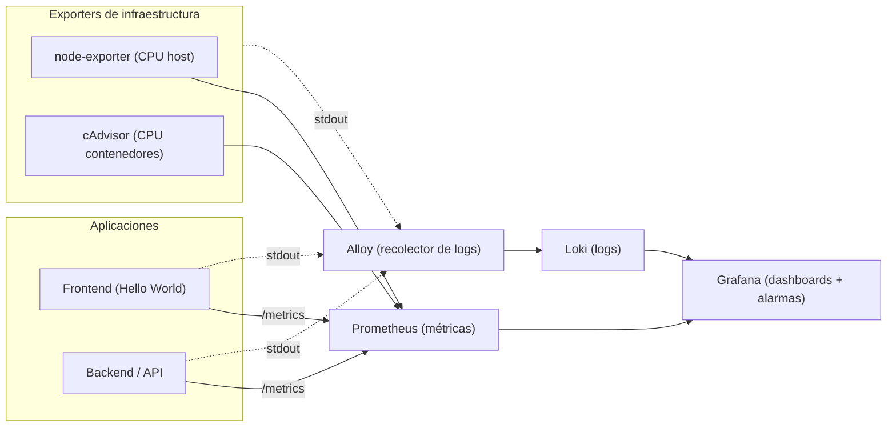

# Laboratorio de Observabilidad

**Curso: Infraestructura como Código** 
**Estudiante:** Bryan Gabriel Ruiz Tulumba

---

## 1. Objetivos de aprendizaje

Al terminar este laboratorio serás capaz de:

1. Explicar el rol de cada componente de un stack de observabilidad (métricas, logs, visualización y recolección) y por qué se aprovisiona como código.
2. Levantar el stack completo con un único `docker compose up`, entendiendo qué provisiona cada servicio.
3. Construir un **dashboard** en Grafana que combine métricas de infraestructura y logs de aplicación e infraestructura.
4. Configurar una **alarma** que se dispare cuando el uso de CPU supere el 50% y verificar su funcionamiento.

---

## 2. Arquitectura del laboratorio



---

## 3. Comandos para el desarrollo

Levantar el stack con:

```bash
docker compose up -d --build
```

Verificar estado con:

```bash
docker compose ps
```

Listo, la primera parte ya estaría completa.

**¡OJO!, importante,** para reiniciar completamente el laboratorio y borrar datos:

```bash
docker compose down -v
```

---

## 4. Servicios importantes levantados

| Servicio | URL | Contenido a ver |
|----------|-----|-----------|
| Frontend | http://localhost:8080 | Página "Hello World" con dos botones  |
| Backend  | http://localhost:3001/metrics | Texto de métricas en formato Prometheus |
| Grafana  | http://localhost:3000 | Login (usuario `admin`, clave `admin`)  |
| Prometheus | http://localhost:9090/targets | Interfaz de Prometheus    |
| Alloy | http://localhost:12345 | Componentes en estado Healthy |

---

## 5. Creación de dashboards

Después de que se levanten los servicios, ir a grafana usando las credenciales y crear un dashboards con 4 diferentes tipos de paneles

```bash
panel: CPU backend (%) | fuente: Prometheus | consulta PromQL: rate(backend_process_cpu_seconds_total[1m]) * 100
```

```bash
panel: CPU del host (%)| fuente: Prometheus | consulta PromQL: 100 - (avg(rate(node_cpu_seconds_total{mode="idle"}[1m])) * 100)
```

```bash
panel: Logs de aplicación (API + frontend) | fuente: Loki | consulta PromQL: {tier="application"} \| json
```

```bash
panel: Logs de infraestructura | fuente: Loki | consulta PromQL: {tier="infrastructure"}
```
---

## 6. Crear la alarma para un CPU > 50%

**Nombre de la alarma: CPU backend > 50%**

Condición de la alarma: rate(backend_process_cpu_seconds_total[1m]) * 100
Umbral: IS ABOVE 50
Label: severity = warning
Contact Point: webhook a `http://backend:3001/alerts`

---

## 7. Activación de alarma → log

El contact point apunta a: http://backend:3001/alerts, Grafana envió la alerta al backend cuando la alarma se disparay este ultimo registra el evento en un log indicando un "grafana_alert_received" (DEMOSTRACIÓN ADJUNTADA EN EVIDENCIAS)

---

## 8. Preguntas del laboratorio


### a. ¿Por qué necesitamos Loki además de Prometheus si ya tenemos /metrics?

Prometheus y /metrics solo manejan números como porcentaje de CPU. Loki existe para los logs, que son eventos con contexto: error en un stack, el mensaje de una excepción, o detalle de una transacción fallida. Prometheus nos dice cuando algo ya salió mal (la métrica), y Loki qué salió mal (el log del error).

### b. ¿Qué ventaja aporta que las fuentes de datos de Grafana estén aprovisionadas como código y no creadas a mano?

Que es reproducible y versionable. Si se destruye el contenedor de Grafana y se vuelve a crear, las fuentes de datos de Prometheus y Loki aparecen sin intervención manual (como clics). En equipo, todos tienen el mismo entorno. Además, los cambios quedan en Git, permitiendo auditar cambios y versiones.

### c. El panel "CPU contenedor" y el panel "CPU host" pueden mostrar valores muy distintos. ¿Por qué? ¿Cuál usarías para alertar sobre una aplicación concreta?

El panel del CPU host muestra el uso de la máquina, sumando los procesos del SO, Docker,  los contenedores y cualquier proceso corriendo. El CPU contenedor muestra solo lo que consume ese contenedor específico. Pueden variar si hay procesos pesados en el host. Para alertar sobre una aplicación concreta usaría el panel de CPU por contenedor, porque refleja el comportamiento de esa app sin ruido externo.

### d. ¿Qué diferencia hay entre el evaluation interval y el pending period de una alarma?

El evaluation interval es cada cuánto Grafana evalúa la condición de la alarma, por ejemplo cada 10 segundos. El pending period es cuánto tiempo debe mantenerse la condición de forma continua antes de que la alarma pase a estado Firing, por ejemplo 30 segundos. Evaluation interval controla la frecuencia de la revisión, y el pending period evita falsos positivos: un pico de CPU de 2 segundos no dispara la alarma si el pending period es 30 segundos.

---

## 11. Evidencias del desarrollo

Se pueden encontrar en: capturas_trabajo/

Archivo : captura_evidencias_Bryan_Ruiz_Tulumba.pdf

Contiene evidencias de:
Stack levantado con los servicios
Panel de CPU por contenedor y panel de CPU del host
Panel de logs de aplicación funcionando
Panel de logs de infraestructura funcionando
Creación y configuración de la alarma CPU > 50%
Alarma en estado Firing
Ciclo cerrado alarma → log vía webhook
Redacción de breve explicación de qué hace cada componente del stack.

---
